# FirebaseServer

El proyecto `FirebaseServer` es un microservicio encargado de gestionar las interacciones con otros microservicios del sistema REAKTOR ya que se encargará de asignar tokens JWT personalizados. Este proyecto depende de [BaseServer](https://github.com/IESJandula/Reaktor_BaseServer) para las configuraciones y utilidades genéricas.

## Descripción de los Servicios y Componentes

### CORSConfig
`CORSConfig` se encarga de la configuración de CORS (Cross-Origin Resource Sharing) para permitir solicitudes de diferentes dominios. Define qué orígenes, métodos HTTP y encabezados están permitidos al interactuar con el microservicio `FirebaseServer`.

### FirebaseConfig
`FirebaseConfig` gestiona la configuración de Firebase, incluyendo la inicialización del SDK de Firebase Admin con las credenciales adecuadas. Este componente carga el archivo JSON de configuración de la cuenta de servicio de Firebase y lo utiliza para interactuar con Firestore, Authentication, y otros servicios de Firebase.

### TokensManager
`TokensManager` es el controlador REST encargado de manejar las solicitudes relacionadas con la autorización de usuarios en el sistema. Proporciona los siguientes endpoints:

- **`/user`**: Genera un token JWT personalizado para un usuario autenticado en Firebase, utilizando su correo electrónico.

- **`/app`**: Genera un token JWT personalizado para una aplicación autenticada en Firebase, utilizando un identificador único. 

## Creación del Archivo `.p12`

Para crear un archivo `.p12` (archivo PKCS#12) para la autenticación, sigue estos pasos:

1. **Genera una clave privada y un certificado**:
   ```bash
   openssl req -x509 -newkey rsa:2048 -keyout private_key.pem -out cert.pem -days 365
   ```
2. **Convierte el archivo PEM a PKCS#12**:
   ```bash
   openssl pkcs12 -export -out apijandula.p12 -inkey private_key.pem -in cert.pem -name "apijandula"
   ```
3. **Dónde almacenarlo**: Guarda el archivo `apijandula.p12` en la carpeta `src/main/resources`.

## Dependencias

Este proyecto depende de [BaseServer](https://github.com/IESJandula/Base_Server/) para funcionalidades básicas como la autorización, almacenamiento de sesión y actualización de JARs.

## Cómo configurar Google Firebase para la autenticación

## Creación de usuarios

Para que el sistema funcione correctamente, es necesario tantos usuarios como personas quieras que accedan a la aplicación. Normalmente, en entorno local solo te bastará con añadir una fila con tu usuario. Para ello, necesitarás hacer un INSERT en la tabla usuario con tu correo electrónico, tu nombre y apellidos, y los roles que quieras tener. En cuanto a los roles, para poder visualizar todas las opciones de la aplicación, se aconseja que el valor sea `PROFESOR,DIRECCION,ADMINISTRADOR`

Repite este paso para cada usuario que necesites agregar al sistema.

## Reaktorización de un proyecto Spring Boot

### Importación y compilación en Eclipse

A la hora de crear un nuevo proyecto o adaptar uno ya existente para su uso con Reaktor se deben tener en cuenta una serie de proyectos maven que hacen la vez de módulos necesarios para su correcto funcionamiento, ya que cada uno de ellos implementa configuraciones o dependencias necesarias.

Dependiendo del IDE la manera de incluirlos en el proyecto final es ligeramente distinta.

En `eclipse` necesitamos los proyectos dentro del workspace común de nuestro proyecto a adaptar o crear. Para ello los incluimos importándolos como proyecto maven:

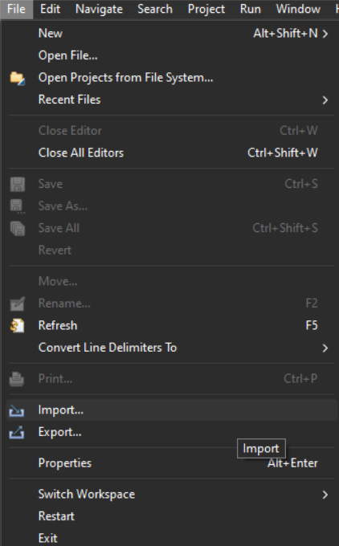

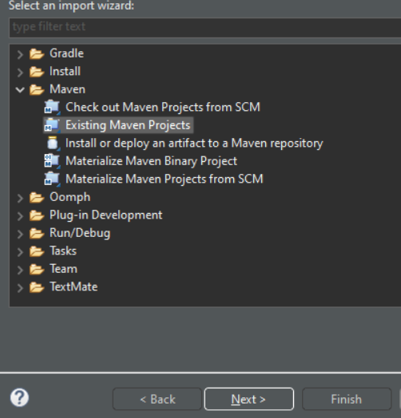

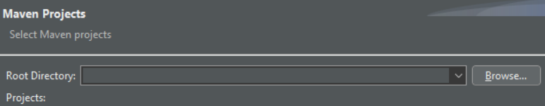

En browse elegimos la carpeta raíz del proyecto maven a importar y hacemos click en finish cuando veamos que detecta el POM.

Una vez lo tenemos importado es importante hacerle un clean install, para ello hacemos click derecho y venimos aquí:

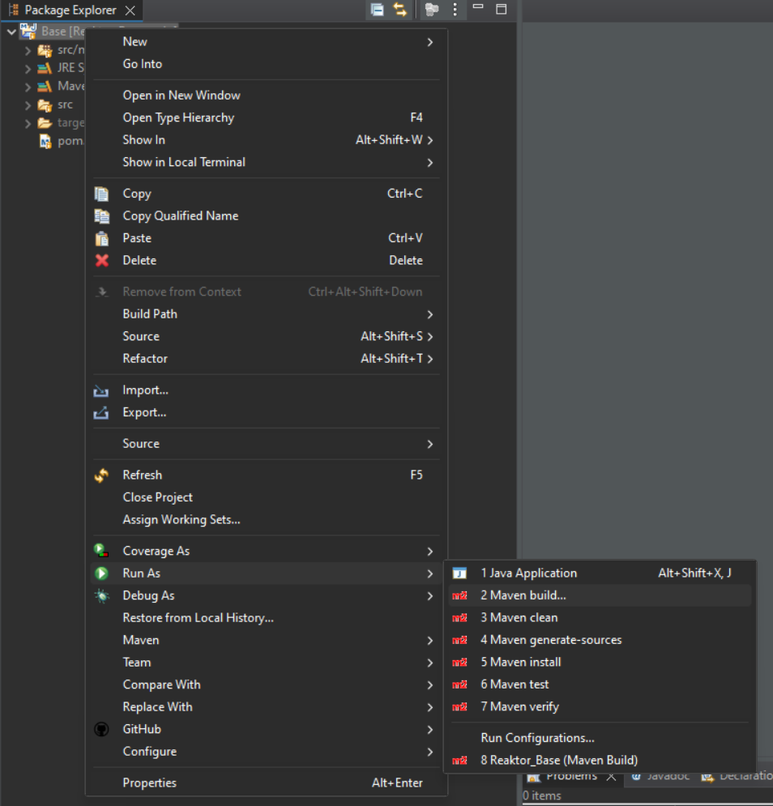

En maven build, en goals, escribimos clean install y ejecutamos:

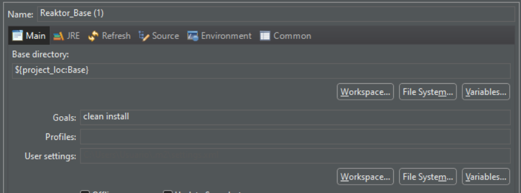

Así aparece si sale bien:

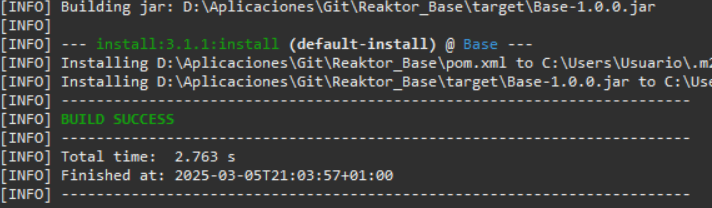

**Importante**: Hay que tener en cuenta el orden a la hora de instalar estos módulos ya que alguno puede depender de que otro esté ya instalado anteriormente

### Proyectos necesarios para importar

Los proyectos Maven de Reaktor previos a importar y necesarios para comenzar a trabajar con otros microservicios:

- [Dependencies](https://github.com/IESJandula/Reaktor_Dependencies/)

- [Base](https://github.com/IESJandula/Reaktor_Base/)

- [BaseServer](https://github.com/IESJandula/Reaktor_BaseServer/)

- [BaseClient](https://github.com/IESJandula/Reaktor_BaseClient/)

- [FirebaseServer](https://github.com/IESJandula/Reaktor_FirebaseServer/)

### Fichero de configuración application.yaml

En el archivo de configuración `application.yaml` de nuestro proyecto es necesario añadir una serie de configuraciones. Ejemplo con el proyecto School Manager:

```
reaktor:
 publicKeyFile: C:\claves\public_key.pem
 privateKeyFile: C:\claves\private_key.pem
 googleCredentialsFile: C:\claves\firebaseGoogleCredentials.json
 urlCors: http://localhost:5173, http://192.168.1.209:5173
```

Para poder obtener el valor de estas propiedades, se hace uso de la anotación `@Value`. A continuación se muestran la descripción de las más importantes:

- **reaktor.publicKeyFile**: Ruta al archivo de clave pública, siendo necesaria en todos los proyectos. Se almacena en `C:\claves`. Para conseguirla, genera la clave pública utilizando el siguiente comando:

```
openssl rsa -in C:\claves\private_key.pem -pubout -out C:\claves\public_key.pem
```

- **reaktor.privateKeyFile**: Ruta al archivo de clave privada, siendo solo necesaria en el proyecto FirebaseServer. Se almacena en `C:\claves`. Para conseguirla, genera la clave pública utilizando el siguiente comando:

```
openssl genrsa -out C:\claves\private_key.pem 2048
```

- **reaktor.googleCredentialsFile**: Ruta al archivo JSON de credenciales de Firebase, siendo solo necesaria en el proyecto FirebaseServer. Se almacena en `C:\claves`. Se explica en el apartado siguiente.


- **reaktor.urlCors**: Lista de orígenes permitidos para las solicitudes CORS, siendo necesaria en todos los proyectos. Define los orígenes permitidos, por ejemplo: `http://localhost:5173, http://192.168.1.209:5173`.

### Cómo configurar Google Firebase y lanzar la web somosjandula

Para crear una cuenta en firebase usaremos una cuenta de google, siguiendo estos pasos:

1. Entramos a la [Consola de firebase](https://console.firebase.google.com/)

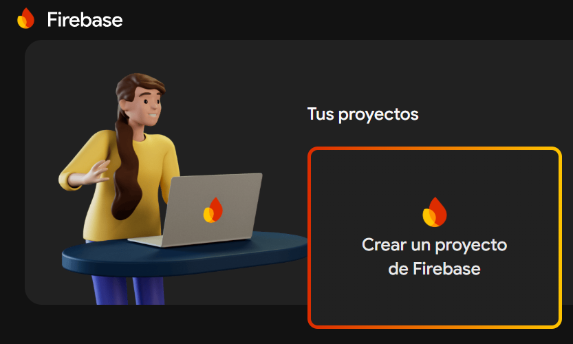

2. Elegimos un nombre y damos a continuar hasta el final (google analytics no es necesario) para crear el proyecto..

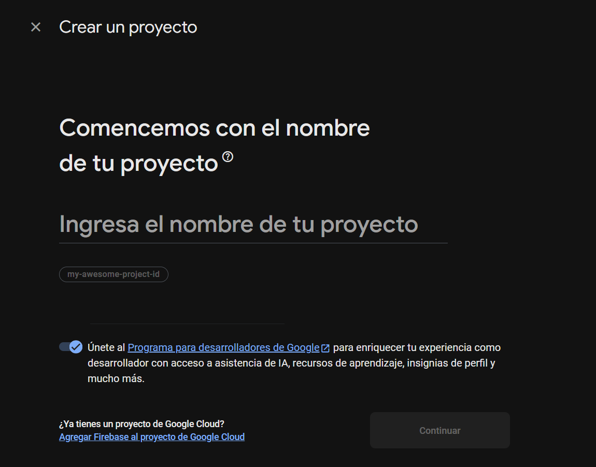

3. Una vez creado elegimos utilizar firebase en nuestra aplicación web desde este botón:


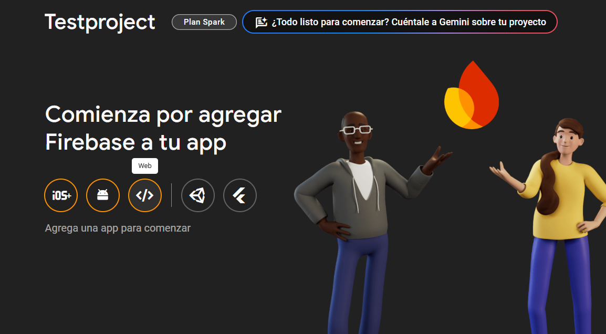

4. Elegimos nombre y registramos

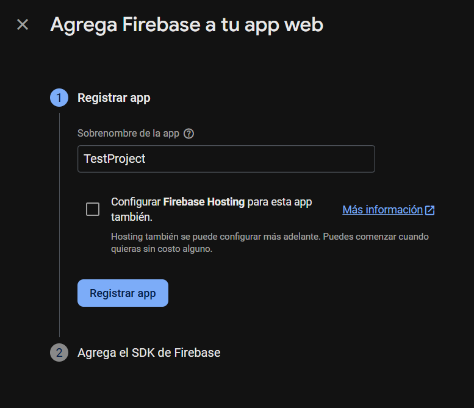

5. Esto nos genera el siguiente bloque de código

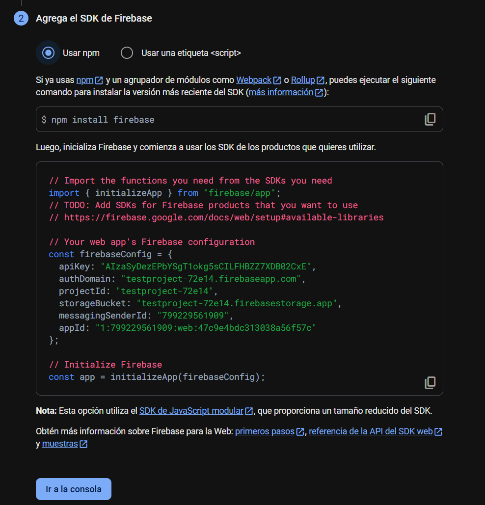

A continuación, en la raíz del proyecto web [Somos Jándula](https://github.com/IESJandula/somosjandula/) nos creamos el archivo de entorno ``.env`` y utilizamos los datos que nos ha generado para rellenar cada uno de los campos, aquí hay un ejemplo de cómo es:

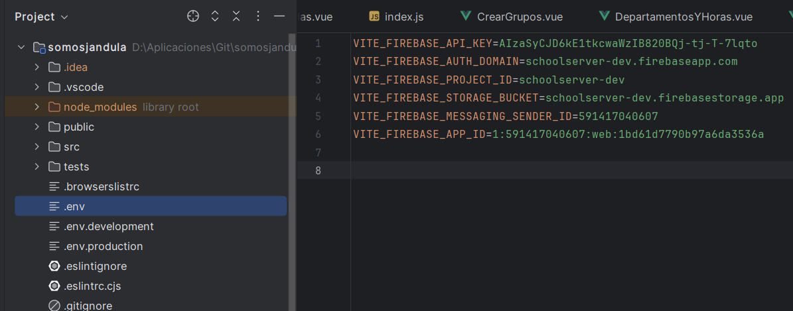

Para lanzar el proyecto web anterior, necesitamos instalar node.js, sino la consola no detecta ``npm``. Tras eso ejecutar el ``npm install`` en la consola cmd, en la raíz del proyecto. Por último, podemos ejecutar el front con ``npm run dev``.

### Anotación necesaria para el arranque de nuestro microservicio

Debemos añadir la anotación siguiente encima de la clase de la aplicación principal de ejecución (la que tiene @SpringBootApplication) del proyecto que se quiere crear o adaptar:

``@ComponentScan(basePackages = {"es.iesjandula"})``

Sin eso no se tendrán en cuenta los módulos añadidos anteriormente y el programa actuará como si no estuvieran.
